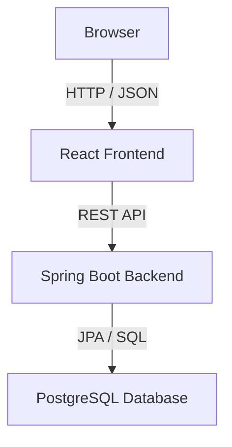

# Tasks


A full-stack task planner application for organizing task lists and their tasks.

The project is split into two independent subprojects:

- **Tasks Frontend** — a React application for interacting with task lists and tasks
- **Tasks Backend** — a Spring Boot REST API with PostgreSQL persistence

Both parts can be developed, tested, built, and released independently, while together they form a complete task management application.

## Features

- Manage multiple task lists
- Create, edit, and delete tasks inside each task list
- Track task status: `OPEN`, `IN_PROGRESS`, and `COMPLETED`
- Assign task priorities: `LOW`, `MEDIUM`, and `HIGH`
- Store task descriptions and due dates
- Display task-list completion progress
- Responsive Material UI based frontend
- REST-based communication between frontend and backend
- PostgreSQL persistence
- Database schema migrations with Flyway
- Automated frontend and backend tests
- Docker Compose support for local infrastructure

## Project Structure
```text 
tasks 
├── tasks-frontend 
└── tasks-backend
```

The frontend and backend are maintained as separate subprojects (git submodules). Each subproject contains its own README with detailed setup, development, testing, and build instructions.

## Technology Overview

### Frontend

- TypeScript 6
- React 19
- React Router
- Material UI
- MUI X Date Pickers
- Axios
- i18next
- Vite
- Vitest
- Testing Library
- ESLint
- Prettier
- npm

### Backend

- Java 25
- Spring Boot 4
- Spring MVC
- Spring Data JPA
- Jakarta Validation
- Flyway
- PostgreSQL 18
- Maven
- Docker Compose
- JUnit 5
- Testcontainers

## Architecture

The application follows a classic frontend/backend structure.



The frontend is responsible for the user interface and user interaction.  
The backend exposes a REST API and handles validation, business logic, persistence, and database migrations.

## Main Capabilities

### Task Lists

Task lists are used to group related tasks. A task list can have:

- a title
- an optional description
- a calculated completion ratio

### Tasks

Tasks belong to a task list and can have:

- a title
- an optional description
- an optional due date
- a status
- a priority

## Getting Started

Clone the repository including its submodules:

```bash 
git clone --recurse-submodules https://github.com/markus-grosshaeuser/tasks.git 
cd tasks
```

If the repository was cloned without submodules, initialize them with:

```bash 
git submodule update --init --recursive
``` 

Then follow the setup instructions inside the individual subprojects:

```text 
tasks-frontend/README.md 
tasks-backend/README.md
```

## Local Development Overview

A typical local development setup consists of:

1. Start the database infrastructure.
2. Start the backend application.
3. Configure the frontend API base URL.
4. Start the frontend development server.

Refer to the subproject READMEs for exact commands and configuration details.

## Testing

Both subprojects include automated tests.

Frontend tests cover React components, dialogs, pages, and utility logic.

Backend tests cover application behavior, persistence, and integration scenarios.

Run the respective test commands from within each subproject.

## Building

The frontend creates a production-ready static build.

The backend creates a runnable application artifact.

Each subproject can be built independently using its own build tooling.

## Releases

The project is versioned as a full-stack application, while the frontend and backend may still have their own internal release cycles.

Version `1.0.0` marks the first stable release of the complete task planner project.

## License

### MIT

MIT License

Copyright (c) 2026 Markus Großhäuser

Permission is hereby granted, free of charge, to any person obtaining a copy
of this software and associated documentation files (the "Software"), to deal
in the Software without restriction, including without limitation the rights
to use, copy, modify, merge, publish, distribute, sublicense, and/or sell
copies of the Software, and to permit persons to whom the Software is
furnished to do so, subject to the following conditions:

The above copyright notice and this permission notice shall be included in all
copies or substantial portions of the Software.

THE SOFTWARE IS PROVIDED "AS IS", WITHOUT WARRANTY OF ANY KIND, EXPRESS OR
IMPLIED, INCLUDING BUT NOT LIMITED TO THE WARRANTIES OF MERCHANTABILITY,
FITNESS FOR A PARTICULAR PURPOSE AND NONINFRINGEMENT. IN NO EVENT SHALL THE
AUTHORS OR COPYRIGHT HOLDERS BE LIABLE FOR ANY CLAIM, DAMAGES OR OTHER
LIABILITY, WHETHER IN AN ACTION OF CONTRACT, TORT OR OTHERWISE, ARISING FROM,
OUT OF OR IN CONNECTION WITH THE SOFTWARE OR THE USE OR OTHER DEALINGS IN THE
SOFTWARE.
```
